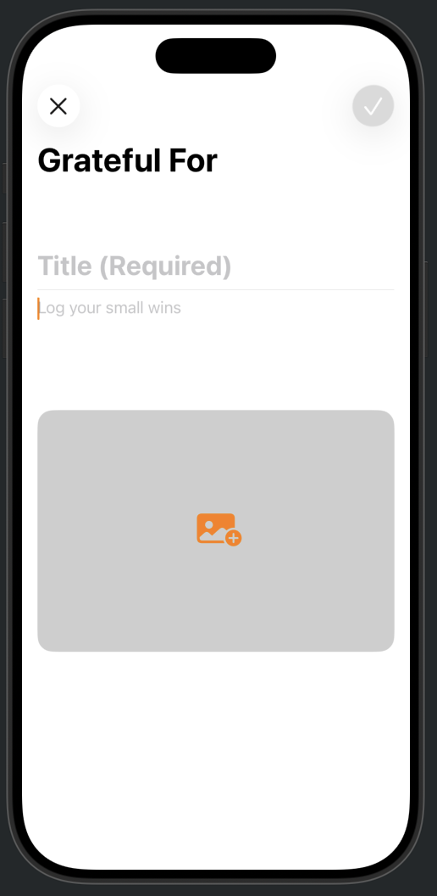
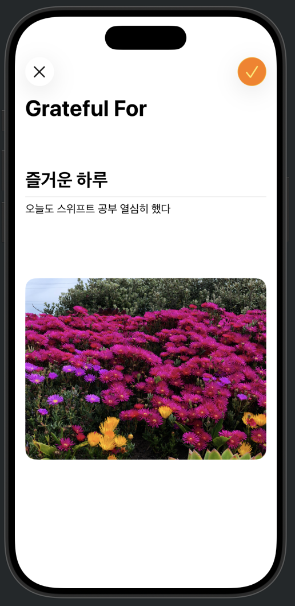

## [App Development] 1-1. Views and data storage - Collect, model, and store data
[🔗 link](https://developer.apple.com/tutorials/develop-in-swift/collect-model-and-store-data)


### .scrollDismissesKeyboard
키보드가 화면 밖으로 스크롤될 때 키보드 숨기기


### PhotoPicker
```
import PhotosUI

@State private var imageData: Data?
@State private var newImage: PhotosPickerItem?

private var photoPicker: some View {
        PhotosPicker(selection: $newImage) {
            Image(systemName: "photo.badge.plus.fill")
                .font(.largeTitle)
                .frame(height: 250)
                .frame(maxWidth: .infinity)
                .background(Color(white: 0.4, opacity: 0.32))
                .clipShape(RoundedRectangle(cornerRadius: 16))
        }
    }
```

- The loadTransferable function transfers the image from the Photos library into your app in the requested Data format.


---
## Preview
<p align="center">
  
  
  
</p>
