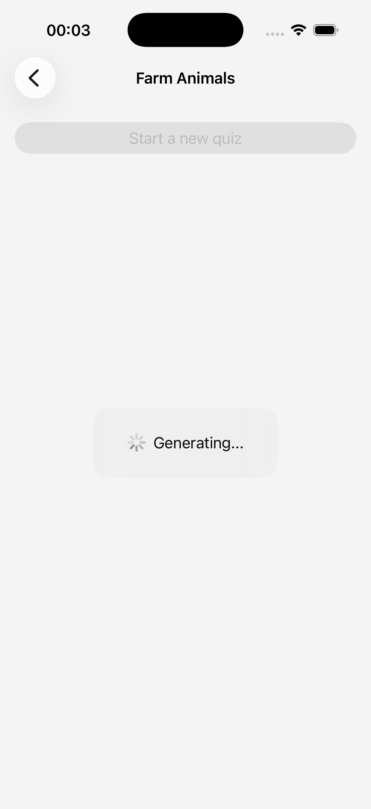
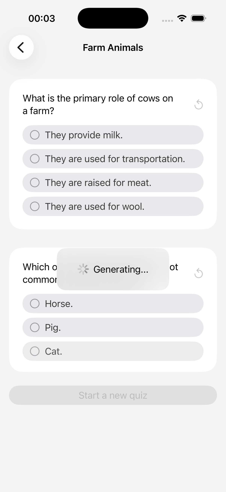
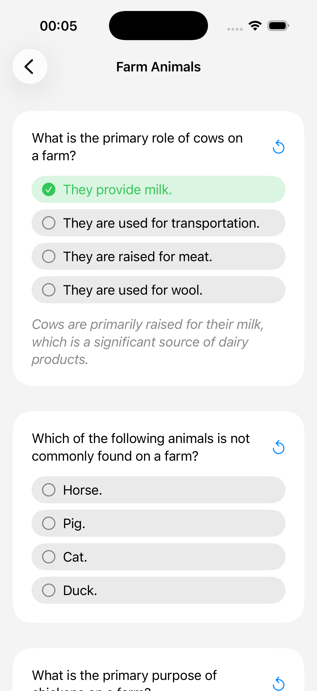
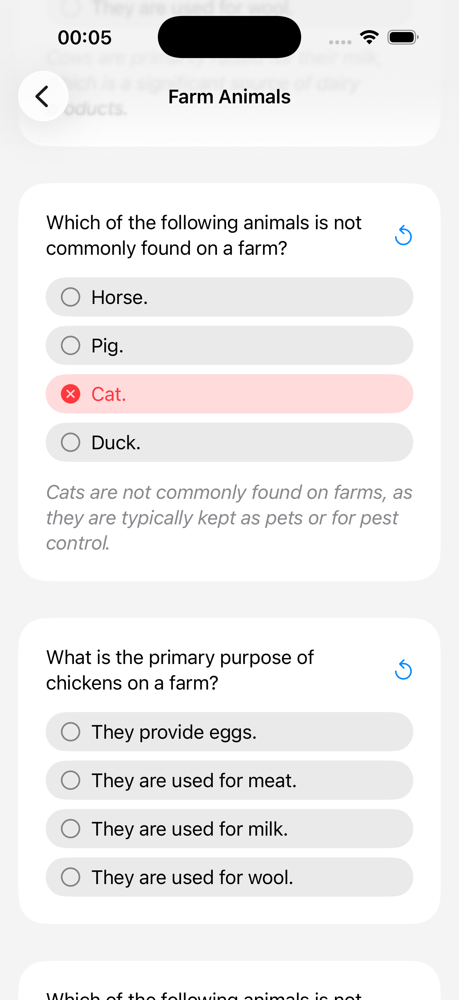

## [Machine Learning and AI] 4-6. Intelligent features with Foundation Models - Generate structed content

[🔗 link](https://developer.apple.com/tutorials/develop-in-swift/generate-structured-content)
---

You give instructions to a [LanguageModelSession](https://developer.apple.com/documentation/foundationmodels/languagemodelsession) to describe or contextualize the data you want back from it. This information acts like a prompt and helps refine the model’s responses.

### ScrollViewReader
버튼을 눌렀을 때 특정 위치로 자동 스크롤되는 기능 구현 가능

---
## Preview

  
  
  
  
  

