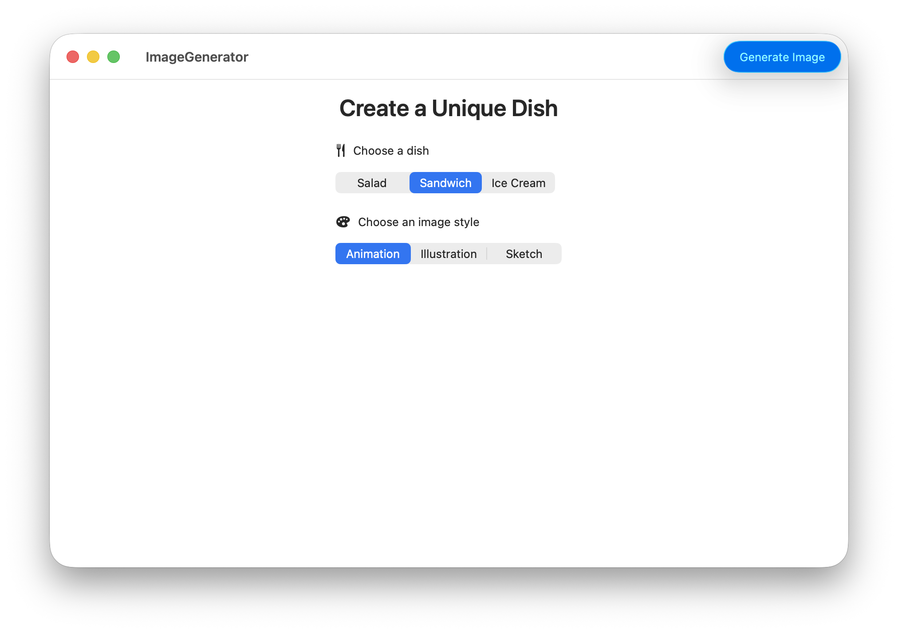
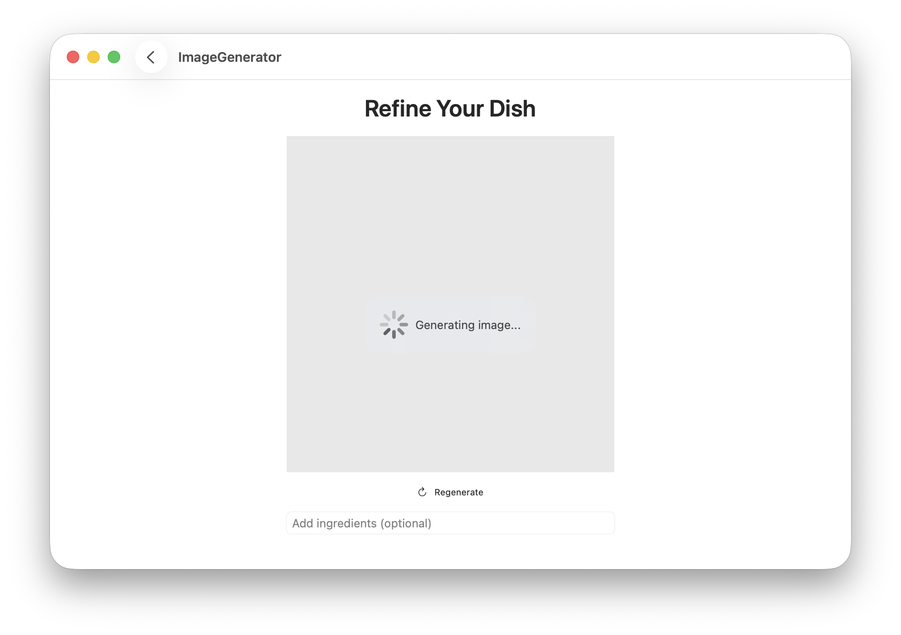
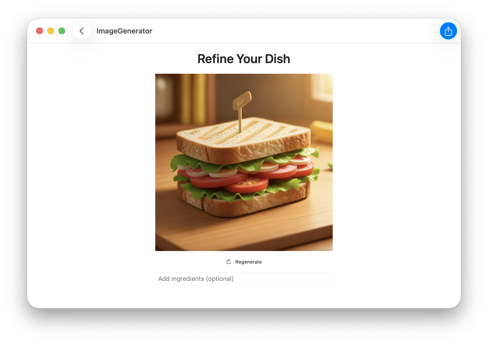
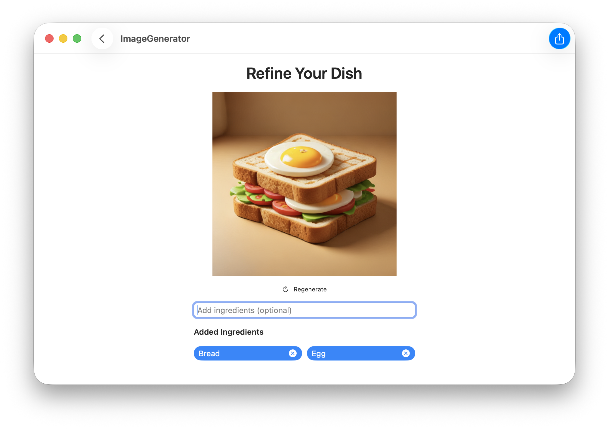
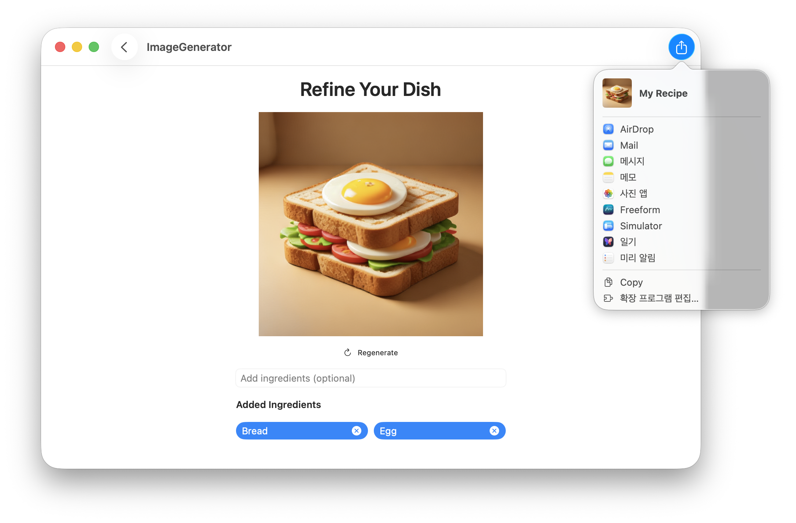

## [Machine Learning and AI] 4-5. Image generation with Image Playground - Utilize image generation features
[🔗 link](https://developer.apple.com/tutorials/develop-in-swift/utilize-image-generation-features)
---

### ImagePlayground
you can generate images programmatically
사용자가 앱 내에서 생성형 AI를 이용해 이미지를 쉽고 재미있게 만들 수 있도록 돕는 도구
- Style : animation, illustration, sketch
- `ImageCreator` : 별도 UI를 띄우지 않고 백그라운드에서 직접 생성형 이미지 결과물을 제어할 때 사용되는 객체
- `ImagePlaygroundConcept` lets you provide text to incorporate into the image-creation process
    - 생성할 이미지의 '재료'를 정의하는 데이터 단위
    - 무엇을 그릴 것인가에 대한 정보를 담는 컨테이너
- `NSImage` : macOS (<-> UIImage : iOS & iPadOS)


### .keyboardShortcut
In macOS, keyboard shortcuts trigger a button’s action in the same way that clicking the button does.


### ShareLink
a view that controls a sharing presentation
```
ShareLink(item: URL(string: "https://developer.apple.com/xcode/swiftui/")!) {
    Label("Share", image: "MyCustomShareIcon")
}
```


---
## Preview
<p align="center">
  
  
  
  
  
</p>


