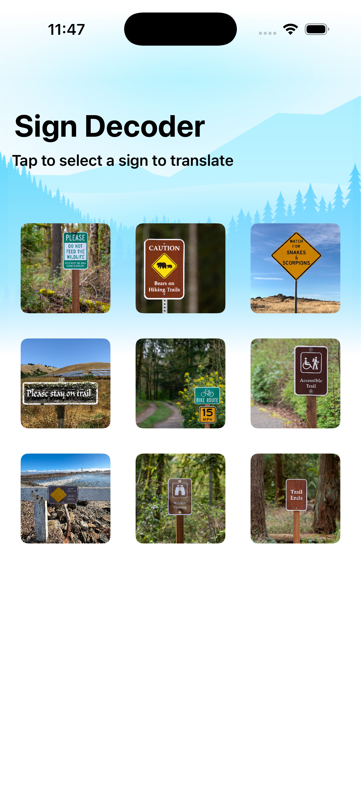
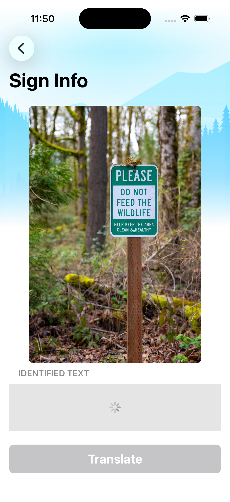
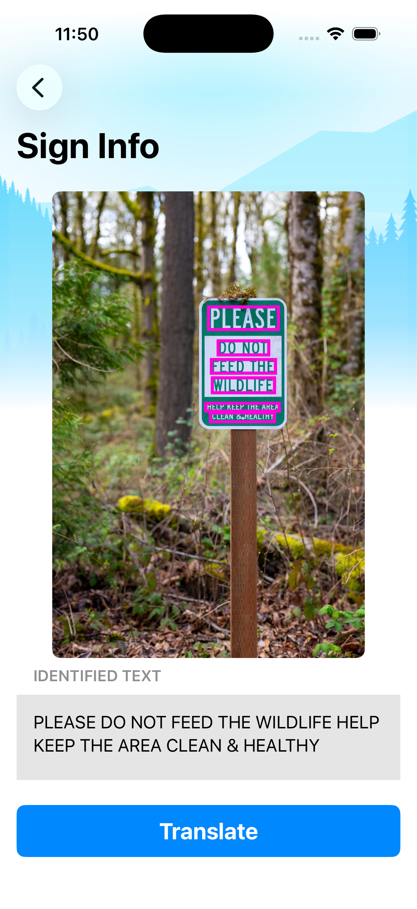
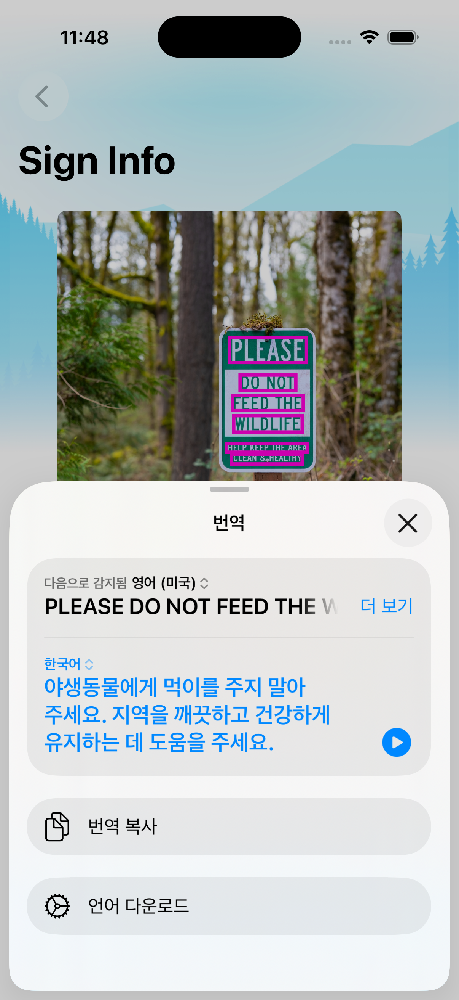

## [Machine Learning and AI] 4-2. Recognize text in images - Extract text from images
[🔗 link](https://developer.apple.com/tutorials/develop-in-swift/extract-text-from-images)


### import Translation
Translation is a complicated problem, and machine learning can provide an easy solution.
- 앱 내에서 텍스트를 다른 언어로 번역하는 기능을 쉽게 제공
- ```.translationPresentation``` : 사용자가 버튼을 누르면, 시스템 번역 시트를 아래에서 위로 띄워줌

[📖 공식 문서](https://developer.apple.com/documentation/translation/)


### import Vision
The Vision machine learning framework can identify a wide range of details in images and videos.
- 이미지 분석 및 컴퓨터 비전 알고리즘
- 이미지 속에 '무엇이, 어디에, 어떤 상태로' 있는지 파악하는 모든 과정
- request > handler > observation

```RecognizedTextObservation```
- Vision 프레임워크가 이미지 내에서 식별한 텍스트
- 각 observation에는 RecognizeTextRequest가 가능한 텍스트 값 목록, 각 가능성에 대한 신뢰도 수준, 그리고 텍스트가 발견된 이미지 영역이 포함
- **topCandidates** 함수로 텍스트에 대한 가능한 값들을 담은 배열 반환 (ex. 1개 반환 : 가장 가능성이 높은 값 하나 반환)

[📖 공식 문서](https://developer.apple.com/documentation/vision)


---
## Preview
<p align="center">
  
  
  
  
</p>


