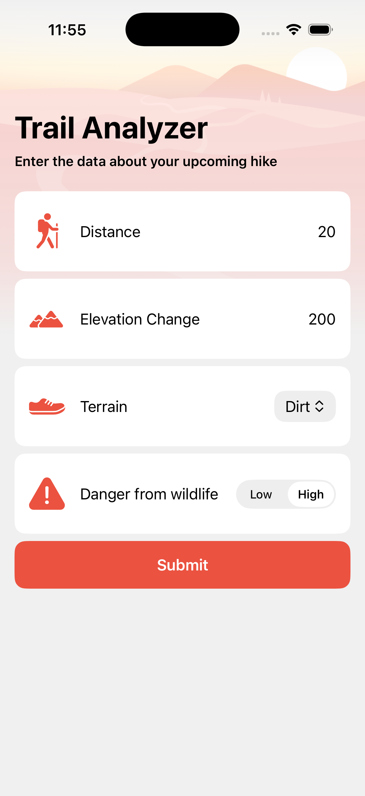
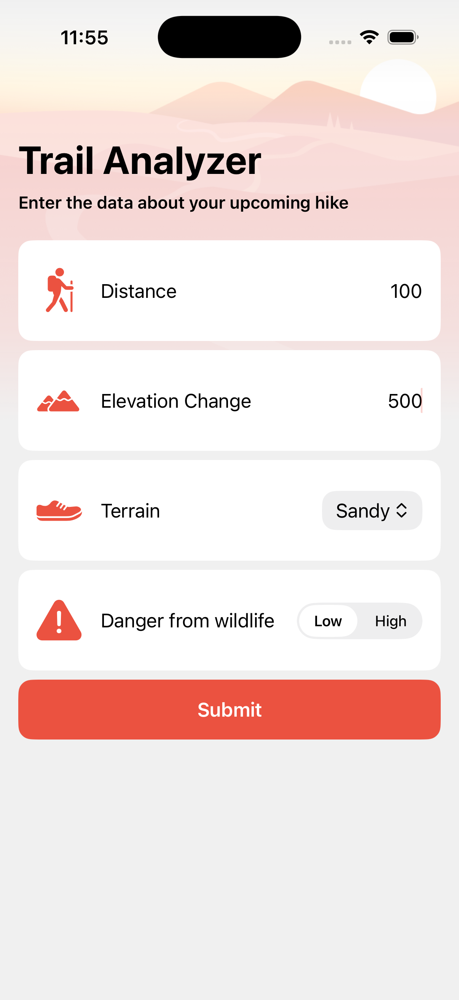
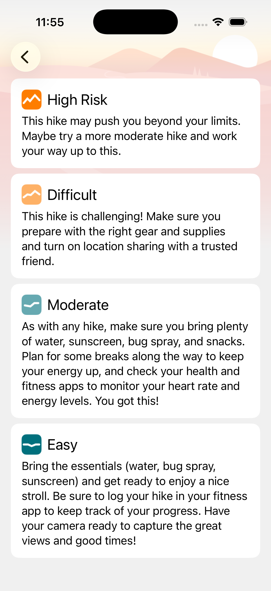

## [Machine Learning and AI] 4-4. Custom models with Core ML - Import models with Core ML
[🔗 link](https://developer.apple.com/tutorials/develop-in-swift/custom-models-with-core-ml)

- 이전에 만든 ML model을 활용해 SwiftUI를 통해 사용자에게 적절하게 output을 보여주는 법
### CoreML
- Apple Silicon 활용, 완전한 온디바이스 실행
- [CoreML](https://developer.apple.com/kr/machine-learning/core-ml/)

---
## Preview

  
  
  
  

